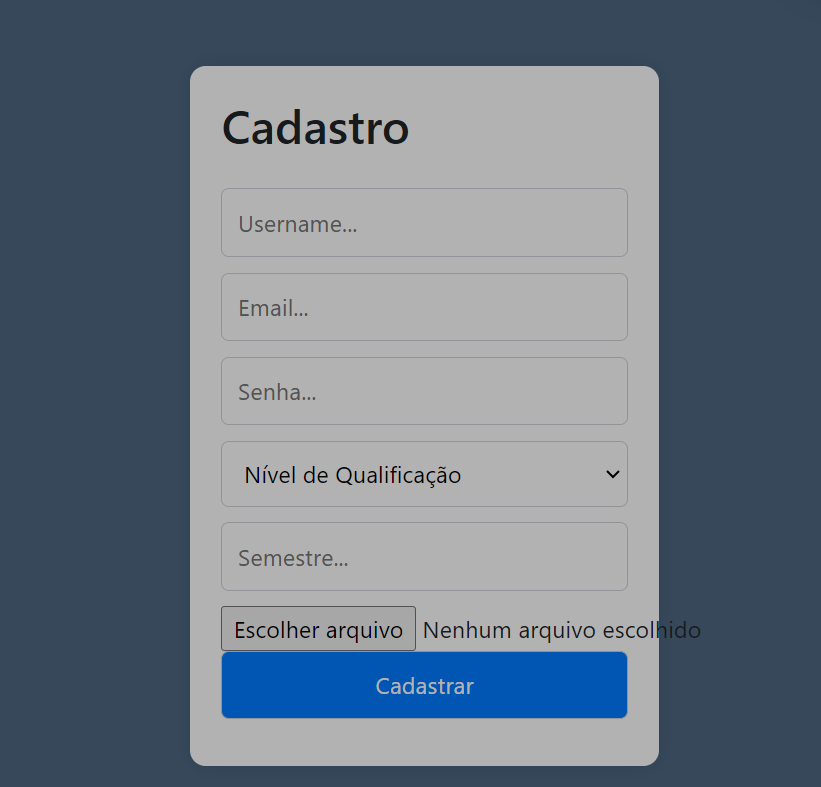
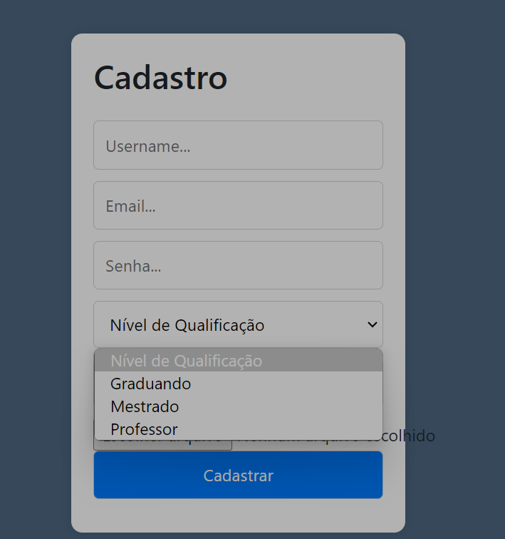

# Instruções de uso

## Cadastro
Clique em criar conta

Preencha os campos, como nome de usuário, que será usado para fazer login, senha, email.

Selecione o Nível de qualificação, se for professor, aluno ou mestrando

se for aluno, selecione o semestre em que está(campo não obrigatório)

coloque uma foto de perfil clicando em "escolher arquivo, esse campo também não é obrigatório.

clique em cadastrar

