# Instruções de uso

## Cadastro
Clique em criar conta
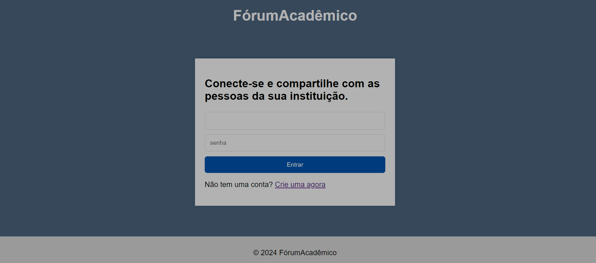

Preencha os campos, como nome de usuário, que será usado para fazer login, senha, email.
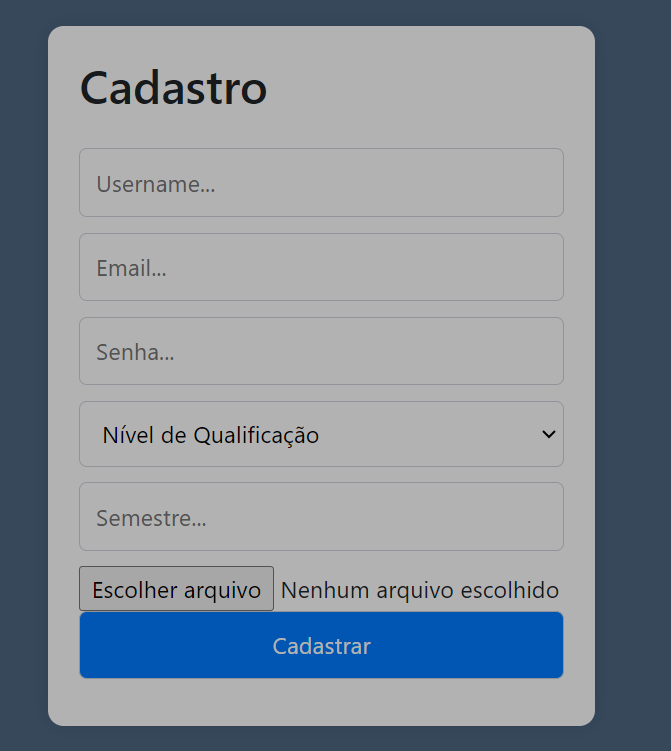

Selecione o Nível de qualificação, se for professor, aluno ou mestrando
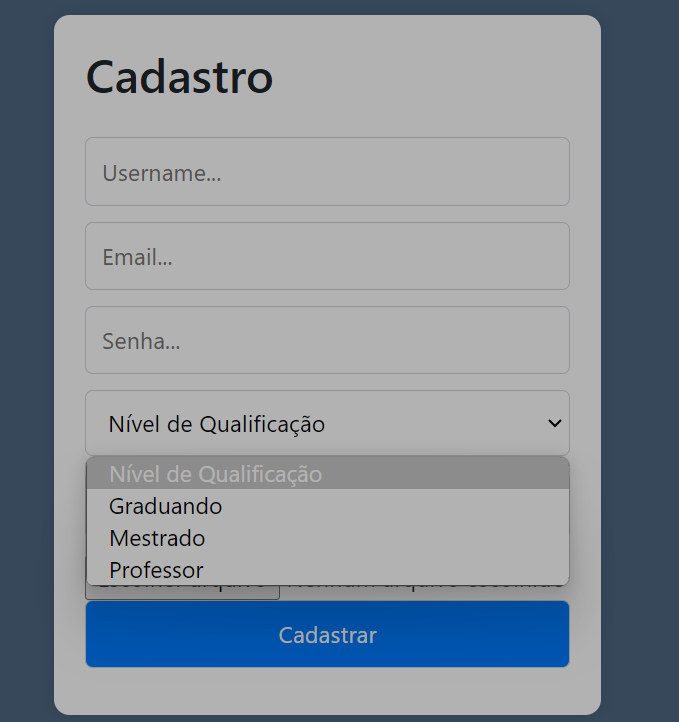

se for aluno, selecione o semestre em que está(campo não obrigatório)

coloque uma foto de perfil clicando em "escolher arquivo, esse campo também não é obrigatório.

clique em cadastrar

# Fazer Login
Após fazer cadastro, aparecerá o botão "Iniciar sessão", clique nele.

Na página de login, preencha os campos com seu username e sua senha.

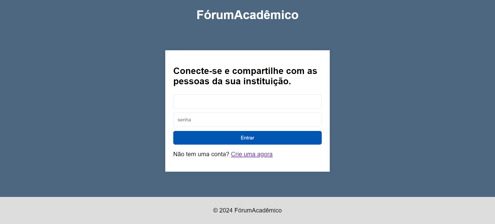

# Deslogar

Clique em Logout

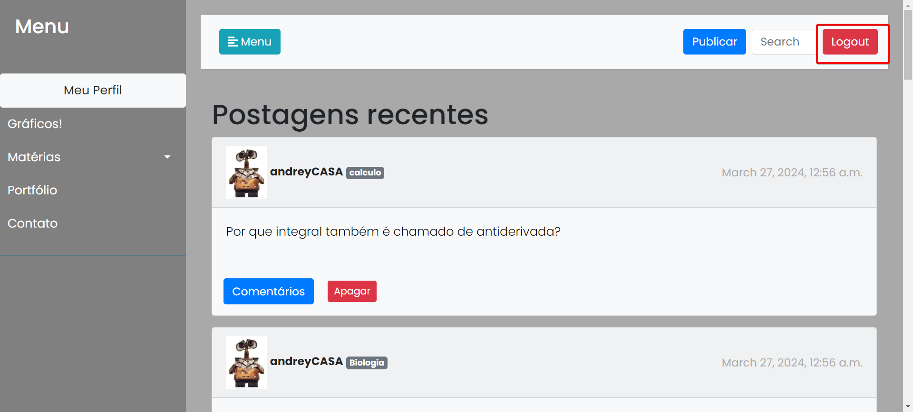

# Fazer Publicação
clique no botão publicar

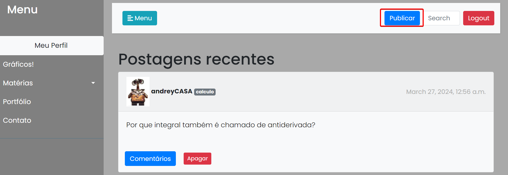

escreva a pergunta no campo de texto

selecione a disciplina 

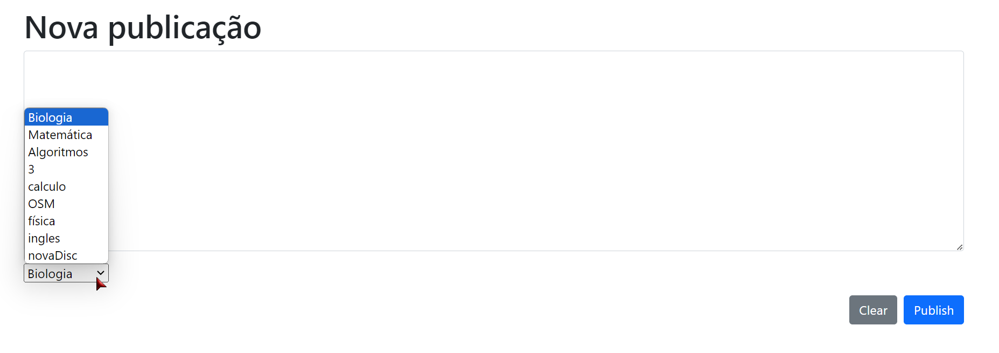

clique em publicar

# Adicionar nova disciplina
Se a disciplina que você deseja fazer perguntas sobre não existir no sistema ainda, você pode criar essa disciplina, indo em Matérias e em Adicionar nova Disciplina, no Menu lateral.

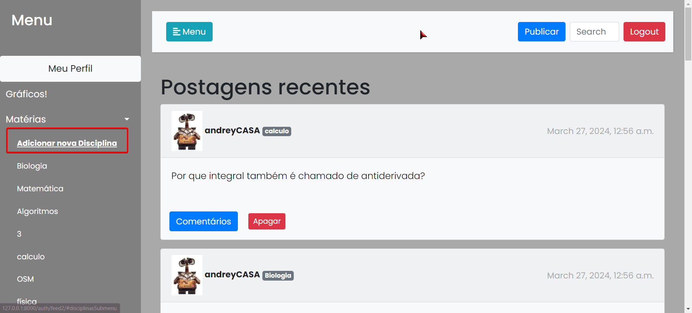

# Ver respostas
Clique em Comentários

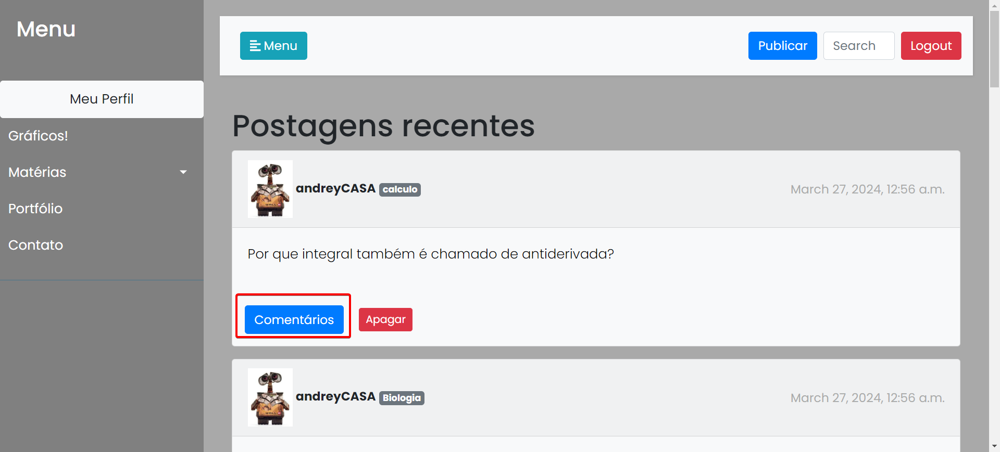

# Responder

Clicar em Comentários

Escreva sua resposta

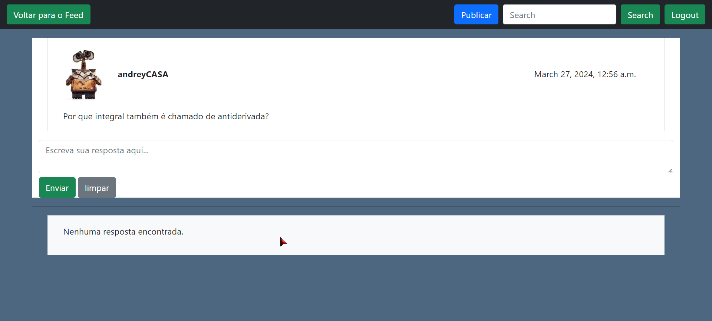

Clicar em Enviar

# Apagar resposta

clicar em apagar resposta

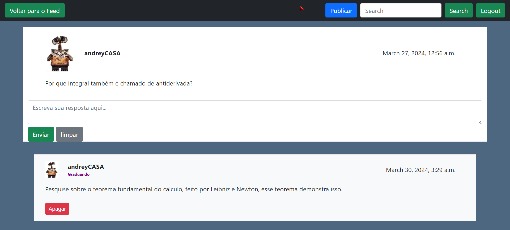

# Filtrar o acesso por disciplinas
no menu, clique em materias, para exibir as matérias e então selecione
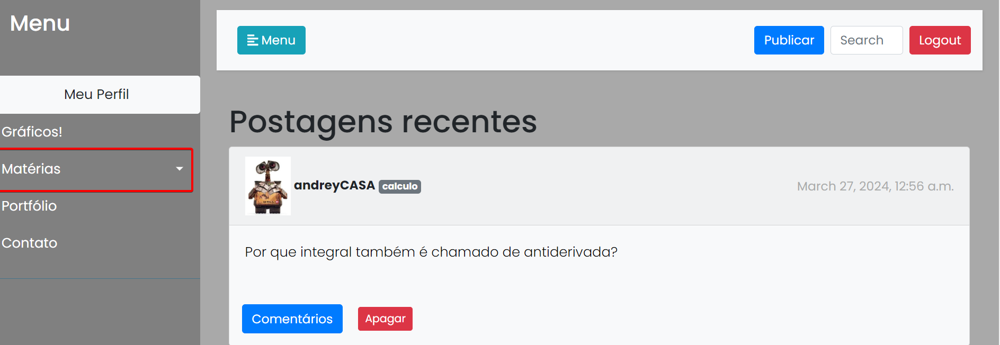

# Ver gráficos de perguntas feitas por disciplina

Clicar em Gráficos! no menu à esquerda

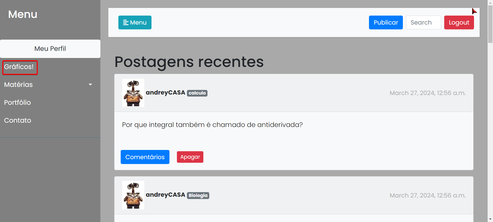

# Ver perfil 

## Ver minhas publicações

Clique em Meu Perfil , no Menu à esquerda

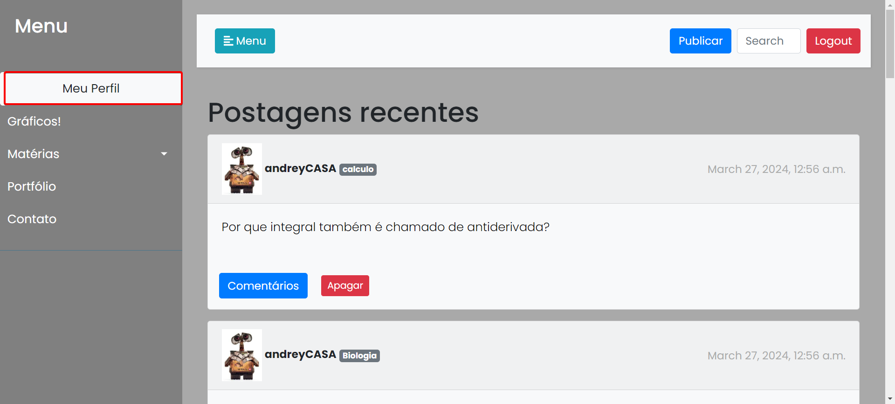

## Editar Perfil
Após clicar em Meu perfil, clique em Editar perfil
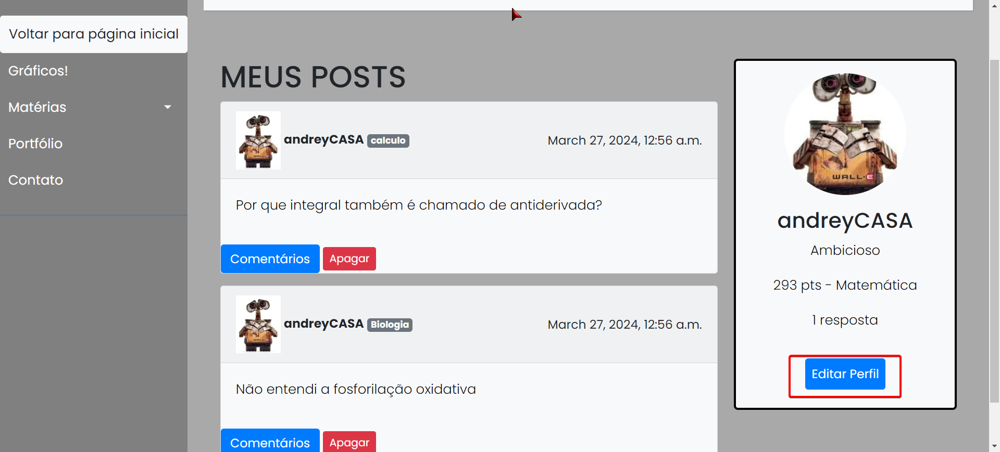

Então altere os dados desejados, em seus respectivos campos
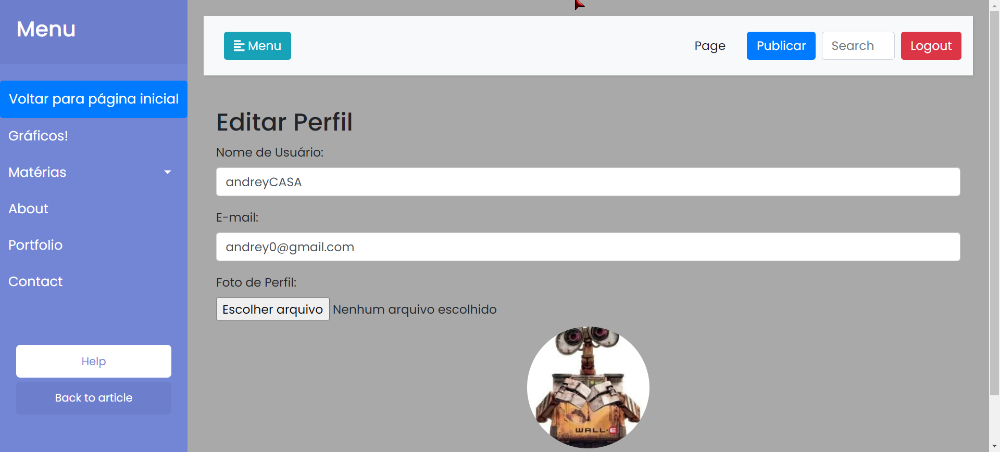
